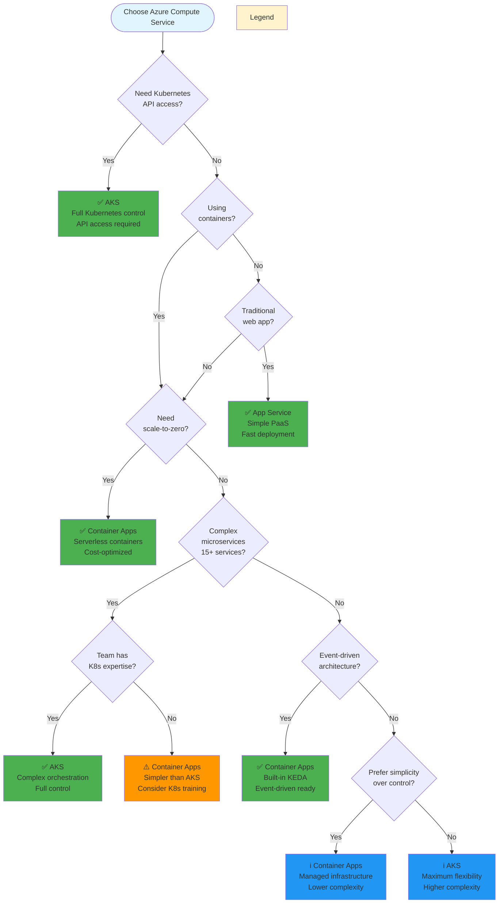

# Decision Tree - Simplified Version

A streamlined 7-question decision tree for quick service selection when you need a fast answer.

## When to Use This

- ✅ You need a quick initial recommendation
- ✅ Your requirements are straightforward
- ✅ You want to filter services before deep analysis
- ✅ Time-constrained decision making

**For comprehensive analysis**, use the [full decision tree](decision-tree-vertical.md) or [decision matrix](../docs/decision-matrix.md).

## Quick Decision Tree

## Decision Shortcuts

### Immediate Selections

**Choose AKS if:**
- ✅ You need Kubernetes API access (no alternatives)
- ✅ 15+ microservices with complex orchestration
- ✅ Team has strong Kubernetes expertise
- ✅ Multi-cloud portability is required

**Choose Container Apps if:**
- ✅ Need scale-to-zero for cost savings
- ✅ Event-driven architecture (queues, events)
- ✅ Want containers without Kubernetes complexity
- ✅ Variable/unpredictable traffic patterns

**Choose App Service if:**
- ✅ Traditional web application or API
- ✅ Not using containers (native code deployment)
- ✅ Need fastest time to production
- ✅ Team has limited DevOps experience

## Next Steps After Quick Decision

1. **Validate your choice** with the [comprehensive decision tree](decision-tree-vertical.md)
2. **Score your requirements** using the [decision matrix](../docs/decision-matrix.md)
3. **Review similar scenarios** in the [detailed guide](../docs/detailed-decision-guide.md)
4. **Compare features** in the [comparison table](../docs/comparison-table.md)

## What's Missing from Simplified Version?

This simplified tree omits these important considerations:
- Operational complexity tolerance
- Cost model preferences
- Networking requirements
- Legacy dependency support
- Portability needs across clouds
- Team expertise assessment

**Recommendation:** Use this for initial filtering, then validate with comprehensive tools.

---

[← Back to Main README](../README.md) | [View Full Decision Tree →](decision-tree-vertical.md)
