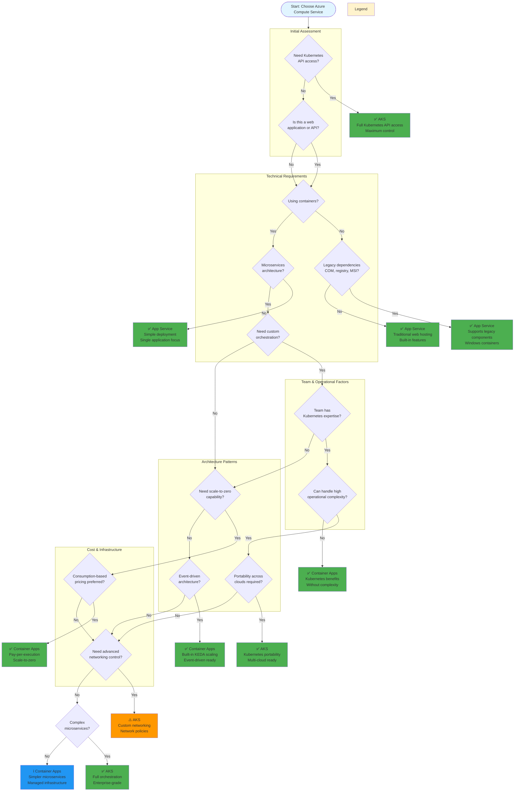

# Decision Tree - Vertical Layout (Top-Bottom)

This is the vertical layout of the comprehensive Azure service decision tree, best suited for scrolling and reading on standard displays.

## How to Use

1. **Start at the top** with the legend to understand recommendation indicators
2. **Answer each question** in the decision nodes (diamonds)
3. **Follow Yes/No paths** until you reach a recommendation box
4. **Review confidence indicators:**
   - ✅ Best fit
   - ⚠️ Consider carefully
   - ℹ️ Alternative option

## Decision Tree

## Interactive Options

- **In VS Code**: Install [Mermaid extension](https://marketplace.visualstudio.com/items?itemName=bierner.markdown-mermaid), then right-click and "Open Preview to the Side"
- **Online Editor**: Copy diagram code to [Mermaid Live Editor](https://mermaid.live/) for interactive exploration
- **Export**: Use Mermaid Live Editor to export as PNG or SVG

## Alternative Views

- [Horizontal Layout](decision-tree-horizontal.md) - Left-to-right flowchart for wide screens
- [Simplified Version](decision-tree-simplified.md) - Quick 7-question decision tree
- [All Diagrams](README.md) - Overview of available diagram formats

---

[← Back to Main README](../README.md) | [View Diagrams Overview →](README.md)
